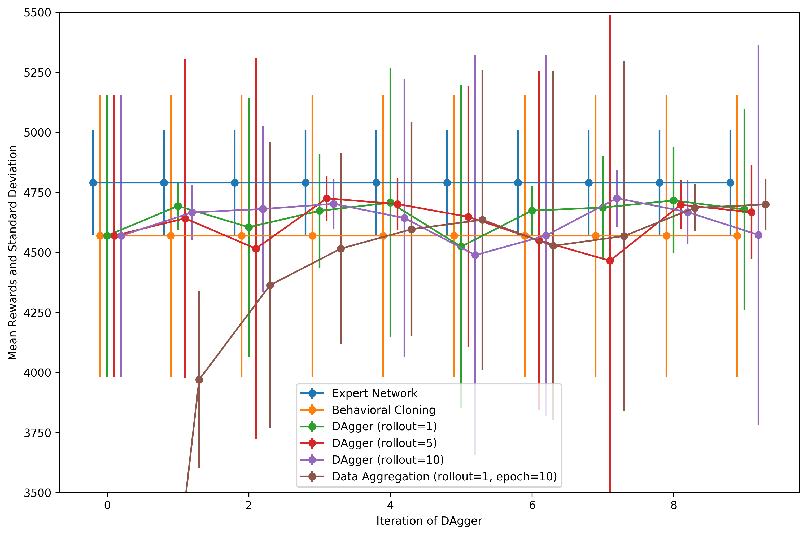

# Homework of CS294 at UC Berkeley

## Preface

This is a PyTorch implementation of the homework of CS294-112 at UC Berkeley on Reinforcement Learning (RL).

The Chinese tutorial of this implementation as well as the theoratical explanination is on the serial artical at Zhihu.com. Here're the links:

* [CS294强化学习课程作业（一）：Imitation Learning](https://zhuanlan.zhihu.com/p/55397927)
* ...

Mark Zhenghao Peng

## The environments

Here are the statistics of the action and observation spaces of those RL environments involved in this course.

|Environments|Action Space|Observation Space|
|:---:|:---:|:---:|
|Ant-v2|(#,1,8)|(#,111)|
|HalfCheetah-v2|(#,1,6)|(#,17)|
|Hopper-v2|(#,1,3)|(#,11)|
|Humanoid-v2|(#,1,17)|(#,376)|
|Reacher-v2|(#,1,2)|(#,11)|
|Walker2d-v2|(#,1,6)|(#,17)|

Note: # means the number of samples.

## Behavioral Cloning (HW1)

We use a simple MLP with a 128 neuron hidden layer as the policy network. The next table presents the hyperparameter used for this experiment.

| Hyperparameter       | Value |
|----------------------|-------|
| # of rollouts (Testing) | 50    |
| # of epochs (Training)   | 50    |
| Learning rate        | 1E-04 |
| Training batch size  | 64    |
| Random seed          | 1     |

The following table shows the experimental results of behavioral cloning methods. The results of the baseline method are the rewards gained by the expert networks. We can see that only in Ant-v2 environment the behavioral cloning method achieve comparable performance compared to the expert network.

| Environment    | Method             | Mean Return | Standard Deviation |
|:----------------:|:--------------------:|:-------------:|:--------------------:|
| Ant-v2         | Expert           |  4790.739    | 219.514           |
|  Ant-v2               | Behavioral Cloning |  **4569.687**    | 587.626            |
| HalfCheetah-v2 | Expert           | 4126.121    | 85.402             |
|  HalfCheetah-v2              | Behavioral Cloning | 656.744     | 923.863            |
| Hopper-v2      | Expert           | 3778.351    | 3.933              |
|  Hopper-v2              | Behavioral Cloning | 90.939      | 1.450              |
| Humanoid-v2    | Expert           | 10403.044   | 51.585             |
|  Humanoid-v2              | Behavioral Cloning | 370.704     | 63.819             |
| Reacher-v2     | Expert           | -4.141      | 1.692              |
|  Reacher-v2              | Behavioral Cloning | -11.201     | 3.709              |
| Walker2d-v2    | Expert           | 5535.365    | 50.152             |
|   Walker2d-v2             | Behavioral Cloning | 275.581     | 3.461              |

## Dataset Aggregation (HW1)

Here's the hyperparameter setting.

| Hyperparameter       | Value |
|----------------------|-------|
| # of rollouts (Testing) | 50    |
| # of epochs (Training)   | 50 or 10    |
| # of rollouts (DAgger) | 1,5,10 |
| # of iterations | 10 |
| Learning rate        | 1E-04 |
| Training batch size  | 64    |
| Random seed          | 1     |

Setting the number of iteration, namely the loop of DAgger, to 10, experimental data is shown in the following table and figure.

| Environment    | Method            | Mean Return | Standard Deviation | Remarks |
|:----------------:|:--------------------:|:-------------:|:--------------------:|:----------:|
| Ant-v2         | Expert       | 4790.739    | 219.514            | |
|  Ant-v2               | Behavioral Cloning | 4569.687    | 587.626            | Previous Result in BC exp. The dataset has 50000 samples.|
| Ant-v2        | DAgger | 4678.976 | 418.485 | 1 episode in aggregation. The final dataset has 60000 samples.|
| Ant-v2        | DAgger | 4667.449 | 194.283 | 5 episodes in aggregation. The final dataset has 100000 samples.|
| Ant-v2        | DAgger | 4573.074| 792.546| 10 episodes in aggregation. The final dataset has 150000 samples. |

In the figure above, vertical line segments are the error bar denoting the standard deviation of the summed rewards among different episodes. Except the experiment represented by the brown line, whose number of epochs is 10, other experiments use 50 as the number of the epoch, that is, 50 times the whole dataset has been fed to train the network.

We can see from the figure that, generally speaking, the DAgger has better performance compared to the BC method, though the performance is highly unstable.