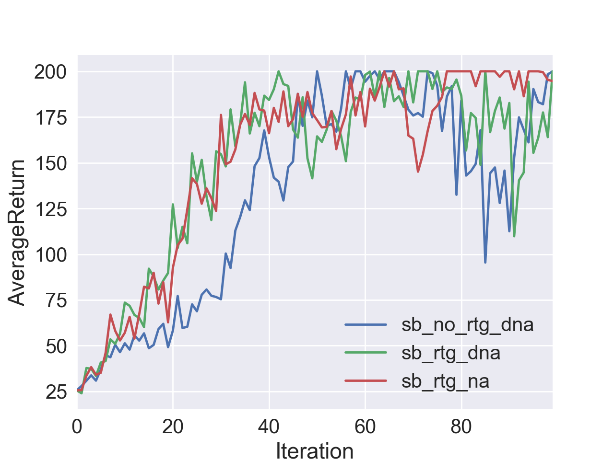

# Homework of CS294 at UC Berkeley

## Preface

This is a PyTorch implementation of the homework of CS294-112 at UC Berkeley on Reinforcement Learning (RL).

The Chinese tutorials of this projects as well as the theoratical explanination are posted at Zhihu.com. Here're the links: 

(Prefix: CS294 Reinforcement Learning Course Notes (No.)...)

* [CS294强化学习课程笔记（一）Imitation Learning](https://zhuanlan.zhihu.com/p/55397927)
* [CS294强化学习课程笔记（二）Policy Gradient](https://zhuanlan.zhihu.com/p/55660949)
* [CS294强化学习课程笔记（三）：Actor-Critic](https://zhuanlan.zhihu.com/p/57879969)
* ...

*Zhenghao Peng*

## Usage

Take a look, modify, and then run `bash run.sh` file at each directory.

## Behavioral Cloning (HW1)

We use a simple MLP with a 128 neuron hidden layer as the policy network. The next table presents the hyperparameter used for this experiment.

| Hyperparameter       | Value |
|----------------------|-------|
| # of rollouts (Testing) | 50    |
| # of epochs (Training)   | 50    |
| Learning rate        | 1E-04 |
| Training batch size  | 64    |
| Random seed          | 1     |

The following table shows the experimental results of behavioral cloning methods. The results of the baseline method are the rewards gained by the expert networks. We can see that only in Ant-v2 environment the behavioral cloning method achieve comparable performance compared to the expert network.

| Environment    | Method             | Mean Return | Standard Deviation |
|:----------------:|:--------------------:|:-------------:|:--------------------:|
| Ant-v2         | Expert           |  4790.739    | 219.514           |
|  Ant-v2               | Behavioral Cloning |  **4569.687**    | 587.626            |
| HalfCheetah-v2 | Expert           | 4126.121    | 85.402             |
|  HalfCheetah-v2              | Behavioral Cloning | 656.744     | 923.863            |
| Hopper-v2      | Expert           | 3778.351    | 3.933              |
|  Hopper-v2              | Behavioral Cloning | 90.939      | 1.450              |
| Humanoid-v2    | Expert           | 10403.044   | 51.585             |
|  Humanoid-v2              | Behavioral Cloning | 370.704     | 63.819             |
| Reacher-v2     | Expert           | -4.141      | 1.692              |
|  Reacher-v2              | Behavioral Cloning | -11.201     | 3.709              |
| Walker2d-v2    | Expert           | 5535.365    | 50.152             |
|   Walker2d-v2             | Behavioral Cloning | 275.581     | 3.461              |

## Dataset Aggregation (HW1)

Here's the hyperparameter setting.

| Hyperparameter       | Value |
|----------------------|-------|
| # of rollouts (Testing) | 50    |
| # of epochs (Training)   | 50 or 10    |
| # of rollouts (DAgger) | 1,5,10 |
| # of iterations | 10 |
| Learning rate        | 1E-04 |
| Training batch size  | 64    |
| Random seed          | 1     |

Setting the number of iteration, namely the loop of DAgger, to 10, experimental data is shown in the following table and figure.

| Environment    | Method            | Mean Return | Standard Deviation | Remarks |
|:----------------:|:--------------------:|:-------------:|:--------------------:|:----------:|
| Ant-v2         | Expert       | 4790.739    | 219.514            | |
|  Ant-v2               | Behavioral Cloning | 4569.687    | 587.626            | Previous Result in BC exp. The dataset has 50000 samples.|
| Ant-v2        | DAgger | 4678.976 | 418.485 | 1 episode in aggregation. The final dataset has 60000 samples.|
| Ant-v2        | DAgger | 4667.449 | 194.283 | 5 episodes in aggregation. The final dataset has 100000 samples.|
| Ant-v2        | DAgger | 4573.074| 792.546| 10 episodes in aggregation. The final dataset has 150000 samples. |

In the figure above, vertical line segments are the error bar denoting the standard deviation of the summed rewards among different episodes. Except the experiment represented by the brown line, whose number of epochs is 10, other experiments use 50 as the number of the epoch, that is, 50 times the whole dataset has been fed to train the network.

We can see from the figure that, generally speaking, the DAgger has better performance compared to the BC method, though the performance is highly unstable.

## Policy Gradient (HW2)
For the problem 4, the following two figures show the influence of *reward to go strategy*, advantage normalization, and the batch size.

The figure above shows the small batch (bs=1000) circumstance. We can see that the reward to go strategy help the convergence of the learning (Green, Red is better than Blue). The advantage normalization help to stablize the learning (compare the Green and Red).

The figure above shows the large batch (bs=5000) circumstance. There is no doubt that the large batch size really helps for convergence. Reward to go, agian, accelerates the training. Advantage normalization shows little influcence under the large batch circumstance.

For the problem 5, we did the grid search among learning rate and batch size at InvertedPendulum environment. The results is on the following figure and show a well-known fact that the performance of reinforcement learning algorithm is sensitive to the hyperparameters.

We can observe from the figure above that only two set of hypter parameters, namely the (bs=1000, lr=0.01) and (bs=5000, lr=0.01), have acceptable performance.

The figure above shows the performance of large batch (bs=10000) with three different random seeds, under the LunarLanderContinuous-v2 environment. It's clear that the random seeds do not differ the performance. The return drop happening at 20 iteration is attributed to the structure of the environment (namely the reward function).

## Actor-Critic (HW3)

The first series of experiment investigate the impact of two hyperparameter introduced by Actor-Critic: the number of target updates (we call it "big iteration", means how many regression steps took for updating Critic), the number of gradients steps per target update (we call it "small itertaion", means how many gradients update steps took for one regression step to fit the target). Please refer to the codes or lectures for more details.

The above figure shows the how different hyperparameters influence the performance in the CartPole benchmark. The experiment names are defined as "ac\_{big iter}\_{small iter}". We can see that if we use large small iteration, which means the target of the regression may be out of date and cannot represent the real value function since it's computed via the old value network, the training may be unstable. The result "lb\_rtg\_na" is directly copied from the Policy Gradient experiment as a baseline.

The above figure shows a different perspective of those experiments. We can see that though achieve similar performance for Actor-Critic algorithm with the Policy Gradient algorithm, the computing overhead is drasticaly reduced using Actor-Critic.

The figure above shows the result of InvertedPendulum benchmark. We can see that though "big iter=10, small iter=10" achieve fastest training, the stability of training of such experiment using multiple gradients step in regression is doubting.
